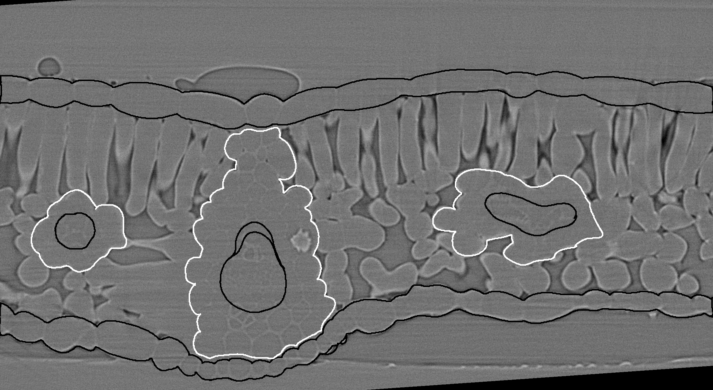
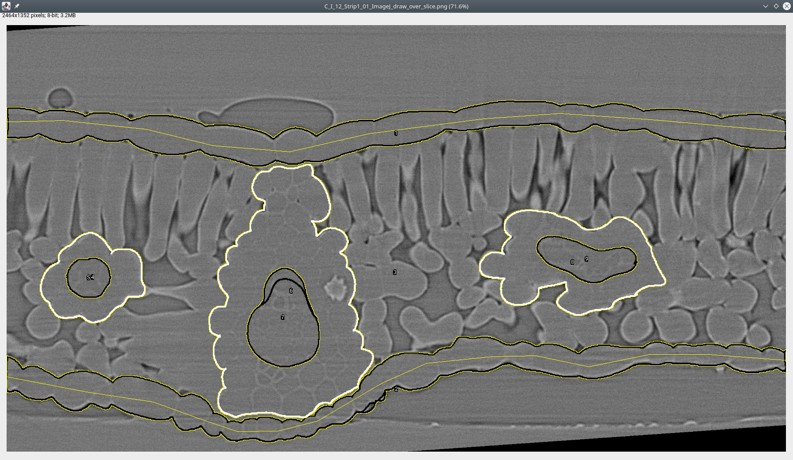
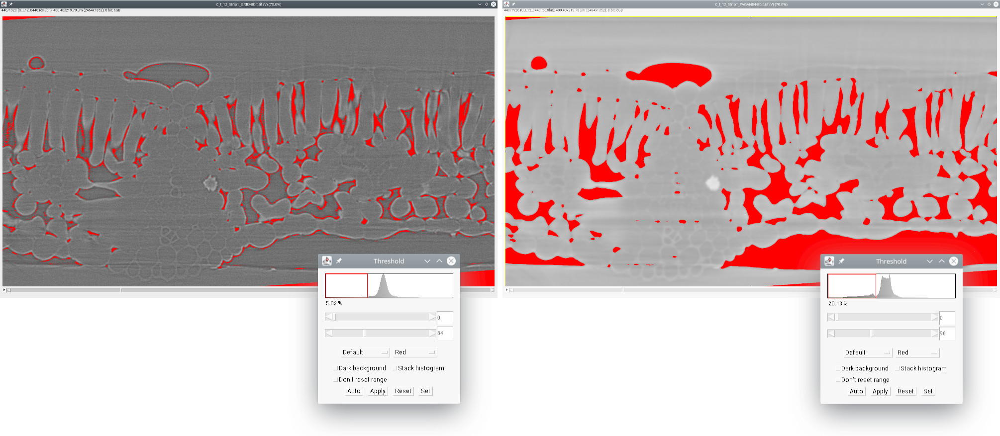
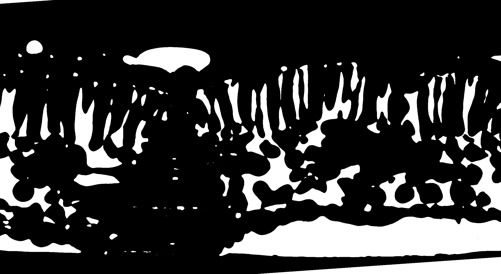
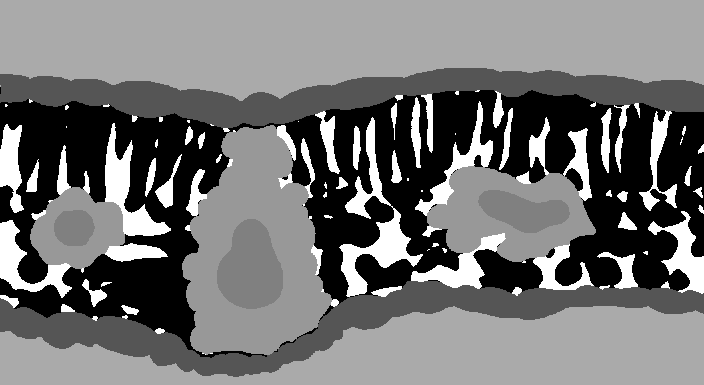

# Tools to process and analyze plant leaf microCT scans

X-ray micro-computed tomography (microCT) is rapidly becoming a popular technique for measuring the 3D geometry of plant organs, such as roots, stems, leaves, flowers, and fruits. Due to the large size of these datasets (> 20 Gb per 3D image), along with the often irregular and complex geometries of many plant organs, image segmentation represents a substantial bottleneck in the scientific pipeline. Here, we are developing a Python module that utilizes machine learning to dramatically improve the efficiency of microCT image segmentation with minimal user input. By segmentation we mean the identification of specific tissues within the leaves as single values within an image file.

We also provide further tools to process segmented images, to extract leaf anatomical traits commonly measured, such as in [Théroux-Rancourt et al. (2017)](#references), or to compute airspace tortuosity and related airspace diffusion traits from [Earles et al. (2018)](#references).

<!-- ![alt text][logo]

[logo]: https://github.com/mattjenkins3/3DLeafCT/blob/add_changes/imgs_readme/leaf1.png "translucent epidermis with veins" -->

## Preprint now online!

I you use this tool, and if you want to know more about the performance of this tool, please see and cite our preprint.

> __Théroux-Rancourt G, Jenkins MR, Brodersen CR, McElrone AJ, Forrestel EJ, Earles JM (2019)__ [Digitally Deconstructing Leaves in 3D Using X-ray Microcomputed Tomography and Machine Learning](https://www.biorxiv.org/content/10.1101/814954v1). bioRxiv 814954; doi: [10.1101/814954](https://doi.org/10.1101/814954)

## Table of contents
- [Package requirements](#requirements)
- [Preparing for automated segmentation](#preparation-of-leaf-microCT-images-for-automated-segmentation)
	- 	[How to draw hand labelled slices](#how-hand-segmentation-is-done-to-create-testing-and-training-labeled-slices)
- [(Semi-)Automated leaf segmentation](#leaf-segmentation-leaf_segmentationpy)
- [Leaf traits analysis (and segmentation post-processing)](#post-processing-and-leaf-traits-analysis)
- [Leaf tortuosity and airspace diffusive traits analysis](#leaf-tortuosity-and-airspace-diffusive-traits-analysis)


## Requirements
- __python 3__: If you are new to python, a nice and convenient way to install python is through [anaconda](https://www.anaconda.com/download/). The code here uses python 3.7, so be sure to install this version. The anaconda navigator makes it easy to install packages, which can also be installed through command line in your terminal. Further, the anaconda navigator allows you to open specific applications to write and run python code. We recommended using an integrated development environment designed for scientific computation, such as [Spyder](https://www.spyder-ide.org/) or [Atom](https://ide.atom.io/).

- __required packages__: To install the required packages, we recommend using the command line interface using this line to install all dependencies:
```conda install pandas scikit-image scikit-learn opencv tabulate tqdm```
The dependencies can also be installed with the anaconda navigator as mentioned above.

- __RAM:__ Processing a 5 Gb 8-bit multi-sliced tiff file can peak at up to 60 GB of RAM and use up to 30-40 Gb of swap memory (memory written on disk) on Linux (and takes about 3-5 hours to complete). Processing a 250 Mb 8-bit file will be a lot faster (30-90 minutes) but will still require up to about 10 Gb of RAM. The current program is memory savvy, which will be addressed in future versions of the program.

### Download the code to your computer

There are two ways to copy the code to your computer:

- [Clone the repository](https://help.github.com/articles/cloning-a-repository/): Using `git` will allow you to conveniently download the latest changes to the code. Follow the link to set up the cloning of the repository. Afterwards, when new versions come, you can pull the changes to your computer, [like here](https://help.github.com/articles/fetching-a-remote/).
- Download the code: At the top right of the github page, you'll see a green button written _Clone or download_.

## Preparation of leaf microCT images for automated segmentation

Before the development of the machine learning segmentation tool, image stacks were segmented by hand (as in [Théroux-Rancourt et al. (2017)](#references)). For example, one would draw over a vein on a single slice, add that region of interest (ROI) to the ROI manager in ImageJ (using the _t_ keyboard shortcut), then move the ROI to a new position on the same vein, then add this other region to the ROI manager, and so on until one had covered that specific vein over the whole stack. Interpolating the ROIs creates a ROI for each slice, which can be filled with a color designating vein. This was done for all tissues and was quite time consuming, especially for non-parallel veins.

To prepare an image for this software, first requires high quality hand segmentation of a few slices of your full stack. The better the hand segmentation, the better the trained segmentation model will be.

Generally, 6 to 14 hand segmented slices can be used, with more or less equal success, but we haven't tested the interaction between the number of slices used and different leaf types. Six slices would be a very acceptable minimum, but this minimum would depend on the venation pattern and the scan's quality.

#### How hand segmentation is done to create testing and training labeled slices
Start several slices away from the edges, so that you cover at least three cell layers in the palisade and at least one full cell in the spongy. Some steps in the machine learning segmentation (e.g. local thickness) do not produce good results near the beginning and the end of the stack, so it's better to avoid those. For example, on a _Vitis vinifera_ scan done at 40x, we avoided the first and last 80 slices.

Each tissue is drawn over in ImageJ using the _pencil_ or _paintbrush_ tool. It is easier than using the _polygon selection_ tool as you can easily pause and also undo changes, and you can make mistakes that won't matter in the end (see pictures below). If you have some tissues touching each other, use another color. For example, I generally draw in black over the _gridrec_ stack, and draw in white any tissues touching others, like the bundle sheath (white) touching the epidermis (black) in this image:

<p align="center">
	
</p>

Follow these steps to generate the output below. The order in which the ROIs are added is important for the later steps:
- Use then the _magic wand_ selection tool to select both portions of one epidermis, then hit _t_ to add it to the ROI manager. I repeat this process for the other epidermis.
- Then draw using _polygon selection_, passing through each epidermis so that it creates a polygon encompassing the whole mesophyll. This selection is added to the ROI manager and will be used to create a background for the testing/training slices.
- Move now over each vein/bundle sheath pair, selecting the bundle sheath first with the _magic wand_, adding it to the ROI manager, repeating for the vein. Repeat this step for each vein/bundle sheath pair.

<p align="center">
	
</p>

Several ROIs are now in the ROI manager. Save all of them by selecting them all (e.g. using _ctrl+a_ in the ROI manager) and then saving them (_More... > Save_ in the ROI manager). Any filename may be chosen, but we recommend including the slice number, which is usually the first 4 digits of a ROI in the ROI manager. It's important to keep the extension `.zip`.

Once done with a slice and a set of ROIs is saved, clear the ROI manager and repeat the above on another slice.

After having created a ROI set for each draw-over slice (i.e. test/training slices), it is possible to use a [custom ImageJ macro](ImageJ_macros/Slice%20labelling%20-%20epidermis%20and%20BS.ijm.ijm). [gtrancourt](https://github.com/gtrancourt) has created a few over time depending on which tissues he wanted to segment, all named `Slice labelling`. Ask him for which would suit you best and how to edit it. These macros loop over the ROI sets in a folder and create a labeled stack consisting of the manually segmented tissues painted over the binary image (i.e. the image combining the thresholded gridrec and phase stacks). It only labels the tissues mentioned above, so if you want more, contact [gtrancourt](https://github.com/gtrancourt) or try it yourself.

Generate or open the binary stack. As explained in [Théroux-Rancourt et al. (2017)](#references) and shown in a picture below, both gridrec and phase contrast thresholded images are combined together to make a binary image encompassing fine details around the cells and the bulk of the airspace. For each reconstruction type, record the threshold value for later use in the command line implementation of the software.

<p align="center">
	
</p>

This binary stack should be in the same folder as your ROI sets if you plan on using the macro mentioned above. The macro will find all `.zip` files in the folder with the binary stack, open each one, clear the background outside the mesophyll, fill up the epidermises, the bundle sheaths, and the veins. Below, you see how the binary stack ends up in the segmented stack:

<p align="center">
	
	
</p>


If not using the macro above, save the labelled image stack as `labelled-stack.tif` in the folder with your binary stack. This labelled stack is the stack used for training and testing the machine learning segmentation model. If using the macro, a window has also opened with the names of all the `.zip` files. Copy that line to a text editor and keep only the slice numbers: you will need the sequence of slice numbers for the automated leaf segmentation. If not using the macro, record the slice numbers used for labelled slices.

Before moving on to the next step, make sure that your __files are named in a regular way__. For example, in `Carundinacea2004_0447_GRID-8bit.tif`, the sample name (`Carundinacea2004_0447_`) and file type (`GRID-8bit`, the _gridrec_ file for that sample) are present. A consistent file naming is necessary for the leaf segmentation program to run smoothly. Also, the folder should have the same name as the sample (i.e. `Carundinacea2004_0447_` in this example).

Finally, a note about __bit depth__. Preferably, use 8-bit images for the machine learning segmentation. Files are smaller in size and it will take up less RAM. However, the program can have 16 or 32-bit images as input, as long as the correct threshold value is used as an input (see next section).

## Leaf segmentation: `Leaf_Segmentation.py`

##### A note on python versions
This code was initially written in python2 and has now been ported successfully to python3. Both version of the code are available, but as python2 will reach the end of its life in January 2020, the python3 version has been the one maintened and actively developed over the last few months.

Note however that if you used one python version to train the model, you will need to use that specific version as the `joblib` library used to store the trained model cannot open files saved in in another version at this time.

***

The program is currently setup to run non-interactively from the command line using two options. In the first option, the user defines all parameters when calling the software using the command line. For this option, only a single scan can be processed and the user must define all parameters except three parameters which are optional. In the second option, the user passes arguments to the software using `.txt` file(s), which allows running multiple segmentation processes without interruption overnight, for example.

The program is run from the command line interface (`terminal` under macOS, `cmd` in Windows, whatever terminal you use under Linux). Note that under Windows, it is preferable to set the path to your python distribution, [as described here](https://stackoverflow.com/questions/3701646/how-to-add-to-the-pythonpath-in-windows).

***Option 1: Passing arguments using the command line***

Note: If using this option, some arguments are _required_ to be defined and others are _optional_. See below for details. Also, arguments can be defined in any order. However when defining an argument, the argument names must be spelled correctly, with argument names on the left side of the `=` sign, and their definitions on the right side. For example, in `sample_name=Carundinacea2004_0447_` the argument name is `sample_name` and is defined as `Carundinacea2004_0447_`. Do not use spaces in arguments.

From the terminal window, the program is called like this (replacing all `X`s with real values):

```
python /path/to/this/repo/leaf-traits-microct/Leaf_Segmentation_py3.py sample_name=X phase_filename=X threshold_phase=X grid_filename=X slice_numbers_training_slices=X threshold_grid=X nb_training_slices=X path_to_image_folder=/X/X/X

```

Real example in which all required parameters are defined and one optional parameter (`rescale_factor`) is defined:

```
python ~/_github/leaf-traits-microct/Leaf_Segmentation_py3.py sample_name=Carundinacea2004_0447_ phase_filename=PHASE-8bit.tif threshold_phase=82 grid_filename=GRID-8bit slice_numbers_training_slices=83,275,321,467,603,692,710 threshold_grid=123 nb_training_slices=6 path_to_image_folder=~/_github/leaf-traits-microct/image_folder/ rescale_factor=2
```

**Required arguments (option 1):**

`python`: This just calls python 3.

`/path/to/this/repo/leaf-traits-microct/Leaf_Segmentation_py3.py`: This should be the complete path to where the segmentation program is. If you have cloned the repository from github, replace `/path/to/this/repo/` with the path to the `leaf-traits-microct/` repository.

`sample_name`: This the filename and the name of the folder. Right now, it is setup so that the folder and the base file name are exactly the same. The base file name is the first part of your naming convention, like `Carundinacea2004_0447_` which is the name of the folder and also exactly the same as in `Carundinacea2004_0447_GRID-8bit.tif`, the gridrec file name.

`phase_filename` and `grid_filename`: The suffix put after `sample name` as explained above.

`threshold_phase` and `threshold_grid`: The threshold values for the phase and grid reconstructions, respectively.

`slice_numbers_training_slices`: This is the list of slice numbers using ImageJ indexing rules, i.e. with 1 being the first element. Needs to be separated by commas.

`nb_training_slices`: This is the number of slices used to train the model. As shown in the [preprint](https://www.biorxiv.org/content/10.1101/814954v1.full) to this method, the number of training slices can affect the precision of the model, as well as the biological estimates. We consider that 6 training slices should be appropriate minimum for most angiosperms leaves with reticaultate venation. We haven't done exhaustive testing on other types of leaves and will update this section once more leaf types have been tested.

`path_to_image_folder`: Assuming all your image folder for an experiments are located in the same folder, this is the path to this folder (don't forget the `/` at the end).

**Optional arguments (option 1):**

`rescale_factor`: Default is 1 (no rescaling). Depending on the amount of RAM available, you might need to adjust this value. For stacks of smaller size, ~250 Mb, no rescaling should be necessary. Files larger than 1 Gb should be rescaled by 2. This is a downsizing integer that can be used to resize the stack in order to make the computation faster or to have a file size manageable by the program. It will resize only the _x_ and _y_ axes and so keeps more resolution in the _z_ axis. These files are used during the whole segmentation process. Note that the resulting files will be anisotropic, i.e. one voxel has different dimension in _x_, _y_, and _z_.

`threshold_rescale_factor`: Default is 1 (no rescaling). This one resizes _z_, i.e. depth or the slice number, after having resized using the `rescale_factor`. This is used in the computation of the local thickness (computing the largest size within the cells -- used in the random forest segmentation). This is particularly slow process and benefits from a smaller file, and it matters less if there is a loss of resolution in this step. Note that this image is now isotropic, i.e. voxels have same dimensions in all axes.

`nb_estimators`: Default is 50. The number of estimators, or trees, used in the random forest classification model. Usually between 10 and 100. Increasing the value will increase the model size (i.e. more RAM needed) and may not provide better classification.


***Option 2: Passing arguments using `.txt` file(s)***

From the terminal window, the program is called like this:

```
python /path/to/this/repo/leaf-traits-microct/Leaf_Segmentation_py3.py argfiles=arg_file_name.txt
```

Real example, in which three scans are segmented back-to-back without interruption (using three argument files):

```
python ~/_github/leaf-traits-microct/Leaf_Segmentation_py3.py argfiles=arg1.txt,arg2.txt,arg3.txt
```

`python`: This just calls python 3.

`/path/to/this/repo/leaf-traits-microct/Leaf_Segmentation_py3.py`: This should be the complete path to where the segmentation program is. If you have cloned the repository from github, replace `/path/to/this/repo/` with the path to the `leaf-traits-microct/` repository.

`argfiles=arg_file_name.txt`: These are "argument files" built using the architecture described below. An [example argument file for segmentation](https://github.com/plant-microct-tools/leaf-traits-microct/blob/dev/argfile_folder/arg_file_example_SEGMENTATION.txt) is downloaded as part of this repository. Multiple argument files are called by separating them by commas `,` (no spaces). These files are built using a text editor or IDE and then saved as `.txt` files in the `argfile_folder/` folder (also downloaded as part of this repository). In this example, `argfiles` is the argument name (left side of the `=`) and `arg_file_name.txt` (right side) is the definition of the argument.

Once you launch the program from the command line, as above, the program will either begin working on scans or throw the error: `Some of the information you entered is incorrect. Try again.` If this error is encountered, then the `/path/to/this/repo/leaf-traits-microct/argfile_folder/` or the name of an `arg_file_name.txt` (possibly multiple files) was entered incorrectly. Check this information for accuracy and try again. When information used to launch the program from the command line is entered correctly, the program will execute independently. It will print out some messages saying what is being done and some progress bars for the more lengthy computations. It can take several hours to segment each whole stack. The program will deposit all results into a folder called `MLresults/` that will be in the image folder corresponding to each scan.

**On building argument files for segmentation:**

Lines that start with a `#` symbol are cues. Do not edit these lines. See below for descriptions of each argument in the [example argument file for segmentation](https://github.com/plant-microct-tools/leaf-traits-microct/blob/dev/argfile_folder/arg_file_example_SEGMENTATION.txt).

`# sample name`  
`Carundinacea2004_0447_`:  
This the filename and the name of the folder. Right now, it is setup so that the folder and the base file name are exactly the same. The base file name is the first part of your naming convention, like `Carundinacea2004_0447_` which is the name of the folder and also exactly the same as in `Carundinacea2004_0447_GRID-8bit.tif`, the gridrec file name.

`# phase reconstruction filename`  
`PHASE-8bit.tif`:  
The suffix put after `sample name` as explained above.

`# threshold for phase reconstruction (determined in ImageJ)`  
`82`:  
This is the threshold values for the phase reconstruction.

`# grid reconstruction filename`  
`GRID-8bit.tif`:  
The suffix put after `sample name` as explained above.

`# threshold for grid reconstruction (determined in ImageJ)`  
`123`:  
This is the threshold values for the grid reconstruction.

`# number of training slices (6-12 recommended)`  
`6`:  
This is the number of slices used to train the model. As shown in the [preprint](https://www.biorxiv.org/content/10.1101/814954v1.full) to this method, the number of training slices can affect the precision of the model, as well as the biological estimates. We consider that 6 training slices should be appropriate minimum for most angiosperms leaves with reticaultate venation. We haven't done exhaustive testing on other types of leaves and will update this section once more leaf types have been tested.

`# slice numbers for training slices separated by commas only (no spaces)`  
`83,275,321,467,603,692,710`:  
This is the list of slice numbers using ImageJ indexing rules, i.e. with 1 being the first element. Needs to be separated by commas.

`# rescale factor (default is 1)`  
`1`:  
Default is 1 (no rescaling). Depending on the amount of RAM available, you might need to adjust this value. For stacks of smaller size, ~250 Mb, no rescaling should be necessary. Files larger than 1 Gb should be rescaled by 2. This is a downsizing integer that can be used to resize the stack in order to make the computation faster or to have a file size manageable by the program. It will resize only the _x_ and _y_ axes and so keeps more resolution in the _z_ axis. These files are used during the whole segmentation process. Note that the resulting files will be anisotropic, i.e. one voxel has different dimension in _x_, _y_, and _z_.

`# threshold rescale factor (default is 1)`  
`1`:  
Default is 1 (no rescaling). This one resizes _z_, i.e. depth or the slice number, after having resized using the `rescale_factor`. This is used in the computation of the local thickness (computing the largest size within the cells -- used in the random forest segmentation). This is particularly slow process and benefits from a smaller file, and it matters less if there is a loss of resolution in this step. Note that this image is now isotropic, i.e. voxels have same dimensions in all axes.

`# number of estimators (10-100, default is 50)`  
`50`:  
Default is 50. The number of estimators, or trees, used in the random forest classification model. Usually between 10 and 100. Increasing the value will increase the model size (i.e. more RAM needed) and may not provide better classification.

`# path to image folder (needs to end with '/')`  
`/path/to/this/repo/leaf-traits-microct/image_folder/`:  
Assuming all your image folder for an experiments are located in the same folder, this is the path to this folder (don't forget the `/` at the end).


***

## Post-processing and leaf traits analysis: `Leaf_Traits_w_BundleSheath_py3_cmd.py`

With this program, the full stack segmentation predicted with the random-forest machine learning program above is first cleaned up to remove some segmentation errors before saving the post-processed/cleaned up file (saved with `SEGMENTED.tif` as suffix), and then traits are analyzed. The program can be used for both or only for traits analysis when the post-processed file has been saved. Being produced with this function are:

- 3D stacks of the post-processed segmentation, with the `SEGMENTED.tif` suffix.
- A text file (`RESULTS.txt` suffix) with the following anatomical variables measured, and includes other values of importances to the image stack:
	- Leaf area: `LeafArea`
	- Thicknesses: 
		- Leaf: `LeafThickness`
		- Mesophyll: `MesophyllThickness`
		- Adaxial epidermis: `ADEpidermisThickness`
		- Abaxial epidermis: `ABEpidermisThickness`
	- Standard deviation of thicknesses: Same labels as for thicknesses but with `_SD` as the end.
	- Volumes:
		- Leaf: `LeafVolume`
		- Mesophyll: `MesophyllVolume`
		- Adaxial epidermis: `ADEpidermisVolume`
		- Abaxial epidermis: `ABEpidermisVolume`
		- Veins: `VeinVolume`
		- Bundle sheath: `BSVolume`
		- Veins and bundlesheaths together: `VeinBSVolume`
		- Mesophyll cells: `CellVolume`
		- Airspace: `IASVolume`
	- Surface area of the intercellular airspace: `IASSurfaceArea`
	- Other values:
		- Number of slices trimmed at the beginning and at the end of the stack: `_SLICEStrimmed`
		- Number of slices trimmed at the left of the stack in cross sectionnal view: `_X_trimmed_left`
		- Number of slices trimmed at the right of the stack in cross sectionnal view: `_X_trimmed_right`
		- Pixel size: `PixelSize`


***

As with the segmentation function, the program is currently setup to run non-interactively from the command line using `.txt` file(s):

```
python /path/to/this/repo/leaf-traits-microct/Leaf_Traits_w_BundleSheath_py3_cmd.py arg_file_name.txt
```

Real example, in which two scans are analyzed back-to-back without interruption (using two argument files):

```
python ~/Dropbox/_github/leaf-traits-microct/Leaf_Traits_w_BundleSheath_py3_cmd.py arg_analysis1.txt,arg_analysis2.txt
```

`python`: This just calls python 3.

`/path/to/this/repo/leaf-traits-microct/Leaf_Traits_w_BundleSheath_py3_cmd.py`: This should be the complete path to where the trait analysis program is. If you have cloned the repository from github, replace `/path/to/this/repo/` with the path to the `leaf-traits-microct/` repository.

`arg_file_name.txt`: These are "argument files" built using the architecture described below. An [example argument file for analysis](https://github.com/plant-microct-tools/leaf-traits-microct/blob/dev/argfile_folder/arg_file_example_TRAITS.txt) is downloaded as part of this repository. Multiple argument files are called by separating them by commas `,` (no spaces). These files are built using a text editor or IDE and then saved as `.txt` files in the `argfile_folder/` folder (also downloaded as part of this repository).

Once you launch the program from the command line, as above, the program will either begin working on scans or throw the error: `Some of the information you entered is incorrect. Try again.` If this error is encountered, then the `/path/to/this/repo/leaf-traits-microct/argfile_folder/` or the name of an `arg_file_name.txt` (possibly multiple files) was entered incorrectly. Check this information for accuracy and try again. When information used to launch the program from the command line is entered correctly, the program will execute independently. It will print out some messages saying what is being done and some progress bars for the more lengthy computations. It can take several hours to segment each whole stack. The program will deposit all results into a folder called `MLresults/` that will be in the image folder corresponding to each scan (if it is not already).

#### On building argument files for trait analysis:

Lines that start with a `#` symbol are cues. Do not edit these lines. See below for descriptions of each argument in the [example argument file for analysis](https://github.com/plant-microct-tools/leaf-traits-microct/blob/dev/argfile_folder/arg_file_example_TRAITS.txt).

`# sample name`  
`Carundinacea2004_0447_`:  
This the filename and the name of the folder. Right now, it is setup so that the folder and the base file name are exactly the same. The base file name is the first part of your naming convention, like `Carundinacea2004_0447_` which is the name of the folder and also exactly the same as in `Carundinacea2004_0447_GRID-8bit.tif`, the gridrec file name.

`# binary suffix`  
`BINARY-8bit.tif`:  
These are the suffix put after `sample name` as explained above.

`# pixel size (any unit desired)`  
`0.1625`:  
The length of a pixel. Can be any unit. Allows for the computation of the size related traits.

`# rescale factor (default is 1)`  
`1`:  
Default is 1 (no rescaling). In the case you have downscaled the original image during segmentation, this is the upscale the _x_ and _y_ axis by this factor.

`# reuse binary (use True --> use original size, or False --> do not use original size)`  
`False`:  
If you have downscaled the image during the automated segmentation and that your thresholded stack, i.e. the binary image, gave an accurate representation of the mesophyll cells and the airspace, this original sized binary image can be reuse to create the post-processed stack.

`# slices to trim`  
`50`:  
Most often, the automated segmentation performs poorly on the edges of the image stack. This can be useful when there are flase classifications and the top and bottom epidermises are connected, for example. With this variable, you can trim, or not, at the beginning and the end of the stack.

`# columns to trim on the left`  
`40`:  
With this variable, you can trim, or not, on the left side of the stack.

`# columns to trim on the right`  
`40`:  
With this variable, you can trim, or not, on the right side of the stack.

`# tissue values in exact order: epidermis, background, mesophyll cell, airspace, vein, bundle sheath`  
`51,204,0,255,102,153`:  
A string of values correspond to the pixel value, found in ImageJ, for the following tissues in this exact order: epidermis (51), background (204), mesophyll cells (0), airspace (255), veins (102), and bundle sheaths (153). If bundle sheaths are absent, insert `-1` instead. In the command line, this would look like: `'51,204,0,255,102,153'`.

`# path to image folder (needs to end with '/')`  
`/path/to/this/repo/leaf-traits-microct/image_folder/`:  
Assuming all your image folder for an experiments are located in the same folder, this is the path to this folder (don't forget the `/` at the end).


A jupyter notebook with examples of the the post-processing and leaf trait analysis code will come soon.

***

## Leaf tortuosity and airspace diffusive traits analysis: `Leaf_Tortuosity_py3.py`
A python version of the method used by [Earles et al. (2018)](#references) has been developped and can be used from the command line. It is now stable and has been used to analysis more than 30 segmented scans in an automated command line function. There are still some glitches with certain stacks and I will troubleshoot that in the following days. Please contact me if you use this function in order to improve it. If you run into an error, please create an issue and copy the error message into it. An interactive version, probably as notebook, will be produced from this code.

Note that the code works only for hypostomatous leaves with stomata on the abaxial surface at the moment. I will implement other types of leaves as I run into them. If you have some, please contact me.

If you use this code to compute the geometric tortuosity and the path lengthening, please cite it as something like this ([full reference to the paper here](#references)):

> ... using the python version (github.com/gtrancourt/microct-leaf-traits) of [Earles et al. (2018)](#references) method...


 
#### What is being produced by the function:

Stacks as tiff files

- 3D stacks of the Tortuosity factor and Path length at the edge of the airspace (32-bit)
- 2D means in cross and longitudinal sections of the above (32-bit)
- 3D stack of the unique stoma airspace regions, i.e. the regions of the airspace colored according to the closest stoma. This is computed by computing the geodesic distance starting for each stoma and comparing with the global geodesic distance. A unique region is then defined as L<sub>geo</sub><sup>i</sup> = L<sub>geo_leaf</sub>, where _i_ is the number of the stoma.
- 3D stack of the airspace outline touching only mesophyll cell, but not touching the epidermis (i.e. the edge of the mesophyll cells).

Results as text files

- 1D profile between epidermis for the Tortuosity factor, Path length, Surface area, and Porosity. Includes also the background space outside of the epidermises.
- Surface area and pore volume of each unique stoma region that are fully bordered by othert stoma regions, i.e. that are not touching the border. Hence, these are the fully regions and avoid the chances a stoma might be just outside the stack and bias the region of influence of a stoma. Data in the unit associated with the pixel size used as input.
- Mean, median, standard deviation, variance, skewness, and value at 50% surface for Tortuosity factor and Path length. By 50% surface, I mean the position within the leaf profile where there is as much mesophyll cell surface area above and below.

***

#### How to use the code

You need a segmented stack with the stomata labelled with a color value that is different to all of the other tissue values of the segmented stack. In ImageJ, I use _red_ (value of 85 in 8-bit), which is different from all other values. The stoma are labelled as an circle or ellipse that start at the point where the stoma opens and is connected to the airspace. I usually draw the ellipse on four slices since I reduce the size of my stacks because of their very large size and the computing power needed for them (i.e. it stalls my 64GB RAM machines too much). If one stoma is not connected to the airspace, the program will stop. But if they are well labelled, then it will work out very well.

To use the code, type the line below in your terminal window:

```
python /path/to/this/repo/leaf-traits-microct/Leaf_Tortuosity_py3.py sample_folder/full_filename rescale_factor pixel_size 'tissue_values' nb_cores '/path/to/your/image/directory/'
```

Real example:

```
python ~/_github/leaf-traits-microct/Leaf_Tortuosity.py C_I_2_Strip1_/C_I_2_Strip1_SEGMENTED.tif 2 0.1625 default 6 '/run/media/gtrancourt/microCT_GTR_8tb/Vitis_Shade_Drought/_ML_DONE/'
```

`python`: This just calls python 3.

`/path/to/this/repo/leaf-traits-microct/Leaf_Tortuosity.py`: This should be the complete path to where the tortuosity program is. If you have cloned the repository from github, replace `/path/to/this/repo/` for the path to the repository (same as for the leaf segmentation code).

`sample_folder/full_filename`: This is the name of the folder in which the segmented stack is, followed by the full segmented stack's name. This will be joined to the path to your image directory. Having both the folder and the full name of the stack here allows to automatically apply the tortuosity function to files found in a base directory (see below for a usage example).

`rescale_factor`: Depending on the amount of RAM available, you might need to adjust this value. I use 2 for large stacks (> 2 Gb). Contrary to the `rescale_factor` in the `Leaf_Segmentation.py`, here the stack is resized in all three dimensions. See `Leaf_Segmentation.py` for other comments on resizing.

`pixel_size`: The length of a pixel. Can be any unit. Allows for the computation of the size related traits.

`'tissue_values'`: Either `default` for the default values I use or a string of values correspond to the pixel value, found in ImageJ, for the following tissues in this exact order (default values in parentheses): mesophyll cells (0), background (177), airspace (255), stomata (85), adaxial epidermis (30), abaxial epidermis (60), veins (147), bundle sheath (102). Repeat the vein value for the bundle sheath if the latter is not segmented, and same thing for the epidermises. In the command line, this would look like: `'0,177,255,85,30,60,147,102'` (don't forget `''`).

`nb_cores`: Optional. If not provided, will use all cores available for some more intensive computation.

`'/path/to/your/image/directory/'`: Assuming all your image folder for an experiments are located in the same folder, this is the path to this folder (don't forget the `/` at the end).


If you want to loop over your image directory, you can do so easily in a UNIX environment using the `find` command. Do do so, open your terminal and change directory up to your image folder (the `'/path/to/your/image/directory/'`). Then, you can loop over all the segmented stacks in that directory like this:

```
find -iname *SEGMENTED.tif -exec python ~/_github/microCT-leaf-traits/Leaf_Tortuosity.py {} 2 0.1625 default 6 '/run/media/gtrancourt/microCT_GTR_8tb/Vitis_Shade_Drought/_ML_DONE/' \;
```

Here, `find` searches for all files ending with `SEGMENTED.tif` and, for each file found pipes it to the `Leaf_Tortuosity.py` function through `{}`, which correspond to a character string with the path from the current directory up to the file found. In my case, `{}` would be replaced by `./C_I_2_Strip1_/C_I_2_Strip1_SEGMENTED.tif` for example, where `./` represent the current directory (which is already specified in the call to the function, so this isn't used).


## References
__Théroux-Rancourt G, Jenkins MR, Brodersen CR, McElrone AJ, Forrestel EJ, Earles JM (2019)__ [Digitally Deconstructing Leaves in 3D Using X-ray Microcomputed Tomography and Machine Learning](https://www.biorxiv.org/content/10.1101/814954v1). bioRxiv 814954; doi: [10.1101/814954](https://doi.org/10.1101/814954)

__Earles JM, Theroux-Rancourt G, Roddy AB, Gilbert ME, McElrone AJ, Brodersen CR (2018)__ [Beyond Porosity: 3D Leaf Intercellular Airspace Traits That Impact Mesophyll Conductance.](http://www.plantphysiol.org/content/178/1/148) Plant Physiol 178: 148-162.

__Théroux-Rancourt G, Earles JM, Gilbert ME, Zwieniecki MA, Boyce CK, McElrone AJ, Brodersen CR (2017)__ [The bias of a two-dimensional view: comparing two-dimensional and three-dimensional mesophyll surface area estimates using noninvasive imaging.](https://nph.onlinelibrary.wiley.com/doi/full/10.1111/nph.14687) New Phytol, 215: 1609-1622.


## Contributors

Active

- [Guillaume Théroux-Rancourt](https://github.com/gtrancourt)
- [Mason Earles](https://github.com/masonearles)
- [Matt Jenkins](https://github.com/mattjenkins3)

This manual was written by [Guillaume Théroux-Rancourt](https://github.com/gtrancourt).

## Comments and contributions

We welcome comments, criticisms, and especially contributions! GitHub
issues are the preferred way to report bugs, ask questions, or request
new features. [Please submit bugs and issues here](https://github.com/plant-microct-tools/leaf-traits-microct/issues). 

## Meta

-   License: MIT
<!-- -   Please note that this project is released with a [Contributor Code
    of Conduct](CONDUCT.md). By participating in this project you agree
    to abide by its terms. -->

<!--
## Change log
##### 2019-03-14
- Tortuosity code now accepts specific color values for each tissue.
- Save the mesophyll edge as a stack (i.e. the airspace minus the surface touching the epidermis).

##### 2019-03-11 - Tortuosity code only
- Tortuosity code is now fully fonctionnal and can be run from the command line.
- Found an error in how the epidermis edge was computed, which caused problem with how the segmentation causes un-smoothed epidermis. Fixed it by drawing a larger epidermis edge (3 pixels length) and purifying the resulting stack to get only one epidermis edge, hence removing the smallish un-connected epidermis elsewhere. This caused a problem when both epidermis have the same label value.
- Removes the values that are direct neighbours to an epidermis when computing statistics for tortuosity and path length.

##### 2019-03-07
- Removed 'verbosity' of the random forest classifying steps. Makes for fewer on-screen outputs and a nicer progress bar when doing the full stack segmentation.
- Added the printing on the slice number used in training and testing.
- Added the number of estimators as an optional input at the end of the command line call of `Leaf_Segmentation.py`.
- Some auto-formatted coding tweaks in `Leaf_Segmentation.py`.
- Changed the images in `README.md` to a _Vitis vinifera_ 40x scan.
-->
